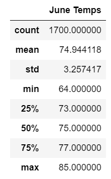
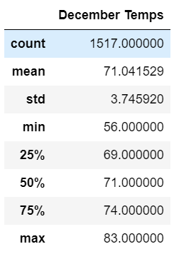

# Climate Analysis

## Overview 
To finance “surf and ice cream shop” W. Avy have some concern about weather as earlier venture failed due to weather conditions. W. Avy is interested to analyse weather data of Oahu to see weather the new shop will face any trouble due to unsuitable weather.
## Purpose
The purpose of this analysis is to analyse weather data of Oahu to assist W. Avy in decision making for investing in surf and ice cream shop. 

## Results

  

  

Fig # 9.1 June month temperature statistics

Statistics of the June month temperature data provide following details:

•	Average temperature for the June month stayed around 74.94 which is pretty good for the business 

•	The standard deviation indicates that temperature observations are closer to mean. Mean temperature for the month of June is 74.94 and turns out to be in support of the shop

•	First quartile temperature is 73 which means bottom 25% observations have temperature less than 73. This is a big positive for the ice cream and surfing business

Considering the statistics for the June month’s temperature, month of June should be appropriate for good business at ice cream and surfing shop.
 

  

Fig # 9.2 December month temperature statistics

Statistics of the December month temperature data provide following details:

•	Average temperature for the June month stayed around 71 which is comparatively low from June month but still it is preferable for the business 

•	The standard deviation indicates that temperature observations are closer to mean. Mean temperature for the month of December is 71 and turns out to be in support of the shop

•	The bottom 25% observations have temperature less than 69, which indicates that 75% observation during the December month are more than 69. Considering December month the temperature is still preferable and shall be supportive of our business

Considering the statistics for the December month’s temperature, month of December shall be preferable for the ice cream and surfing shop.

## Summary

Considering the analysis that we carried out on the temperature data for the month of June and December, it shows that the temperature is in favour of the ice cream and surfing shop. December month average temperature is lower by 2-3 degrees but it is still not a problematic temperature for surfing. Hence, in conclusion we can say June and December both months will be good for Ice cream and Surfing at Oahu location from the temperature perspective.

Two queries which we can write for further analysis can be:

1.	We can get precipitation information for the June month

results = session.query(Measurement.prcp). filter(func.strftime("%m", Measurement.date) == "06")

df = pd.DataFrame(results, columns=["June Precipitation"])

df.describe()

2.	We can get precipitation information for the December month

results = session.query(Measurement.prcp). filter(func.strftime("%m", Measurement.date) == "12")

df = pd.DataFrame(results, columns=["December Precipitation"])

df.describe()

